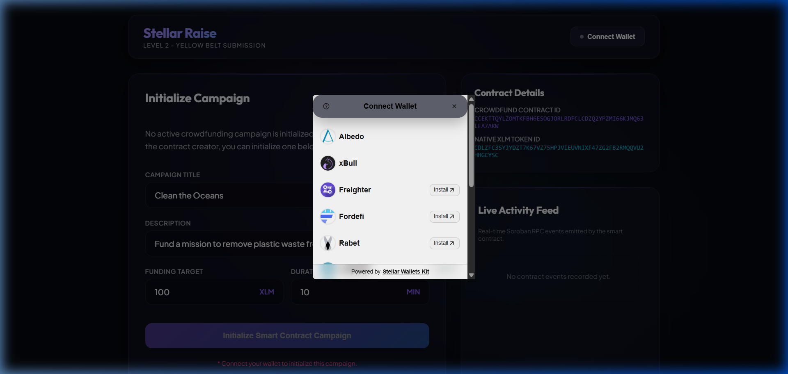

# Stellar Raise - Crowdfunding dApp (Soroban)

A decentralized, real-time crowdfunding platform built on the Stellar Testnet using Soroban smart contracts and a React+TypeScript frontend.

This project is built as a submission for the **Stellar Journey to Mastery - Level 2 (Yellow Belt)** builder challenge.

---

## 🚀 Deployed Addresses & Tx Hashes (Stellar Testnet)

*   **Crowdfunding Contract ID**: `CCEKTTQYLZOMTKFBH6ESOGJORLRDFCLCDZQ2YPZMI66KJMQ63LFA7AKW`
    *   [Verify on Stellar Lab](https://lab.stellar.org/r/testnet/contract/CCEKTTQYLZOMTKFBH6ESOGJORLRDFCLCDZQ2YPZMI66KJMQ63LFA7AKW)
*   **Native XLM Token Contract ID**: `CDLZFC3SYJYDZT7K67VZ75HPJVIEUVNIXF47ZG2FB2RMQQVU2HHGCYSC`
*   **WASM Upload Transaction Hash**: `1abe7027b7d9ab930907e8827f8d06f816469e5bc146cf723936427979412091`
    *   [Verify on Stellar.expert](https://stellar.expert/explorer/testnet/tx/1abe7027b7d9ab930907e8827f8d06f816469e5bc146cf723936427979412091)
*   **Contract Deployment Transaction Hash**: `a45b315576cd287c8b754c0c04df1dd8b321fabd86be0a98cd4c9872c9b83270`
    *   [Verify on Stellar.expert](https://stellar.expert/explorer/testnet/tx/a45b315576cd287c8b754c0c04df1dd8b321fabd86be0a98cd4c9872c9b83270)

---

## 🛠️ Project Architecture

```
yellow-belt/
├── contracts/                  # Soroban Smart Contract (Rust)
│   ├── contracts/crowdfunding  # Crowdfunding contract code
│   │   ├── src/lib.rs          # Main contract business logic
│   │   └── src/test.rs         # Unit tests suite
│   ├── Cargo.toml              # Cargo workspace configuration
│   └── Cargo.lock              # Package lockfile
├── src/                        # React Frontend Client (TypeScript)
│   ├── App.tsx                 # Main Dashboard, Forms & Wallet connection
│   ├── stellar.ts              # Soroban RPC client functions & event polling
│   └── index.css               # Modern glassmorphism dark-theme CSS
├── index.html                  # HTML entry point
├── package.json                # Frontend client dependencies
├── tsconfig.json               # TypeScript config
└── README.md                   # Setup & project documentation
```

---

## 📦 Prerequisites

Ensure you have the following installed locally:
1.  **Node.js**: `v20.x` or `v22.x` (with `npm`)
2.  **Rust Toolchain**: `v1.80+` with the `wasm32v1-none` target added (`rustup target add wasm32v1-none`)
3.  **Stellar CLI**: `v27.0.0+`
4.  **Stellar Wallet Extension**: A supported browser wallet extension (such as Freighter, xBull, or Albedo) set to the **Stellar Testnet** and funded via the [Testnet Faucet](https://faucet.stellar.org).

---

## 🔧 Setup & Installation

### 1. Smart Contract Development & Verification

Navigate to the `contracts` workspace and run the test suite:
```bash
cd contracts
# Run contract unit tests
cargo test
# Compile the contract to WebAssembly
stellar contract build
```

### 2. Frontend Client Setup

From the root directory, install npm packages and start the Vite development server:
```bash
# Install dependencies
npm install

# Run the development server
npm run dev
```
Open your browser at `http://localhost:5173`.

---

## 📱 Wallet Connection Screenshot

Here is the screenshot showing the wallet connection options modal powered by `StellarWalletsKit`:



---

## 📜 Smart Contract Business Logic

*   `initialize`: Configures the funding goal, duration, title, description, and target asset.
*   `pledge`: Backers can transfer XLM to the contract. The contract tracks individual contribution balances in persistent storage and raises the total contribution indicator. Emits a `pledge` event.
*   `withdraw`: Once the goal is reached and the campaign is closed, the creator can withdraw all funds. Emits a `withdraw` event.
*   `refund`: If the campaign closes under-target, backers can retrieve 100% of their pledges. Emits a `refund` event.
